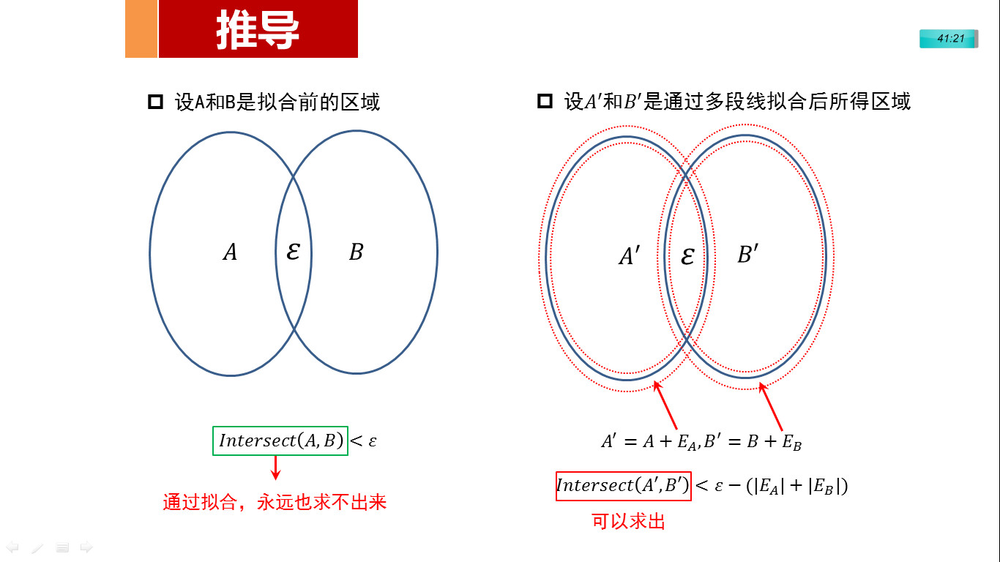
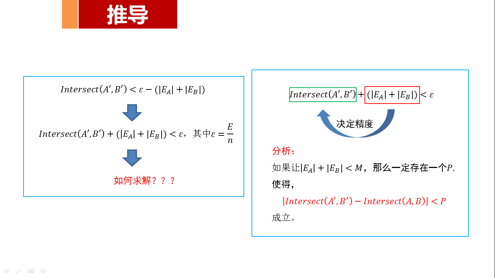
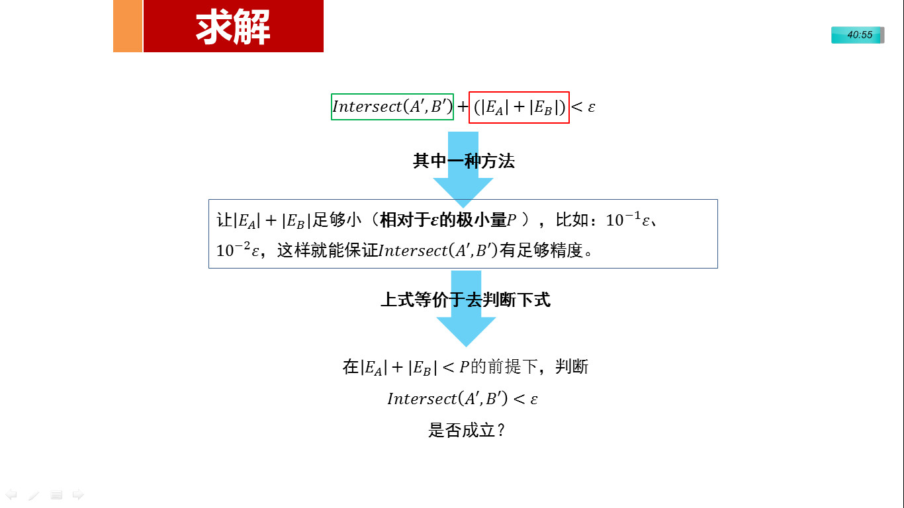

圆弧插入多少点拟合合适？(Ⅱ)(应用)
==================================

> 此前讨论过圆弧拟合中的误差问题，但讨论的目的是为了更好的应用。所以在今天给出"地块重叠检测"这一个应用案例。

上图中有两个地块A和B，它们的边界分别是弧线（图中看起来似乎已经重叠成一条弧），且之间可能存在重叠。在进行CAD二次开发中，需要求出A和B在图中显示弧段重叠的面积。但是在CAD中无法直接求出两弧段所代表区域的重叠面积，首先需要将两地块的弧边进行多段线拟合，然后求解一个近似的重叠面积。我们知道两弧段拟合的越精细，所求得的重叠面积越准确，但是做到无限精细是不可能的，在实际中也是没必要的，我们所关系的是在弧段拟合到什么情况下能够保证我们的精度要求就可以。下文将对这个问题进行抽象，寻求一个一般性的误差控制讨论结果。

图1右边红色需要表示近似对弧线进行拟合，拟合的结果可能比真正面积大也可能小。

