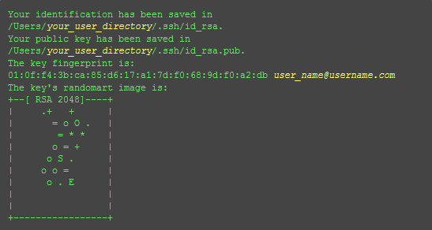

GitHub Pages + Hexo构建博客及问题
=================================

> 相信大多数程序猿都知道Github，它除了提供版本控制的服务外，还提供了一个建立博客的功能——GitHub Pages，GitHub服务器的稳定性得到了大家的认可，相信GitHub Pages的稳定性也不会差。


# 前言
相信大多数程序猿都知道Github，它除了提供版本控制的服务外，还提供了一个建立博客的功能——GitHub Pages，GitHub服务器的稳定性得到了大家的认可，相信GitHub Pages的稳定性也不会差。另外国内访问GitHub的速度还算可以，我曾经Ping过几次，速度在几十毫秒左右，访问GitHub Pages这样的静态博客，就我自己而言，这样的速度可以接受。再者，构建GitHub Pages博客的环境相当简单，归纳起来也就三步左右：

1. Create a repository
2. Clone the repository
3. Create pages and push them

所以决定使用GitHub Pages作为我的博客的“家”。

在刚开始调研在GitHub Pages搭建博客时，GitHub推荐使用Jekll，继续阅读觉得搭建起来还有点麻烦，需要安装这个安装那个，尤其是当自己的系统是Windows是更是如此，后来发现Hexo相对于Jekll容易的多，首先要说明的是我的系统是Win7系统，后面所有安装等操作都是基于此系统。

博客搭建环境：

- Windows系统（Win7旗舰）
- GitHub Pages
- [Node.js: node-v0.10.22-x86.msi](http://nodejs.org/dist/v0.10.22/node-v0.10.22-x86.msi)
- [GitHub客户端](https://desktop.github.com/)

# 博客搭建步骤
## 软件安装

- 想通过Hexo来搭建博客安装Node.js是必须，请自行下载安装，过程省略。

- 继续下载GitHub客户端，下载安装，并将Git Shell更改为Git Bash。

- 最好再安装一个文本编辑器，Windows下我推荐使用Notepad++，此软件开源免费还小巧，功能也不少（至少我是这么认为的，哈哈），但是在编写代码时，请注意编码问题（一般无特殊需求，建议使用UTF-8）。

## GitHub Pages环境配置
### GitHub Pages申请
- 首先你需要有一个GitHub账户，如果没有请点击[这里](https://github.com/)进行注册
- 然后添加一个repository，它的名字要特别注意，必须是：用户名+github.io，其中用户名就是你注册github的用户名，具体的新建和添加第一个“Hello World”测试网页的过程可以参考[这里](https://pages.github.com/)

### ssh keys配置
如果想在本地通过GitHub客户端进行上传代码，就需要首先配置ssh keys：  

1.首先检查你电脑上现有的ssh keys   
```
$ cd ~/.ssh  
```

2.生成新的ssh key  
```
$ ssh-keygen -t rsa -C "chanhal@outlook.com"  # 换成你自己的邮箱
```

系统要求你输入密码：  
```
Enter passphrase (empty for no passphrase):<输入加密串>  
Enter same passphrase again:<再次输入加密串>  
```

在回车中会提示你输入一个密码，这个密码会在你提交项目时使用，如果为空的话提交项目时则不用输入。这个设置是防止别人往你的项目里提交内容。

注意：输入密码的时候没有*字样的，你直接输入就可以了。

最后看到这样的界面，就成功设置ssh key了：  
<!-- 插入图片

-->

<div align="center">

</div>

4.创建之后回到你所在用户的目录，其中id_ras.pub可以用记事本打开，将内容复制至GitHub中，Settings->Deploy keys。
<div align="center">

<p></p>

<!--
<div style="margin-top:0pt;"></div>
-->

</div>

5.测试  
可以输入下面的命令，看看设置是否成功，git@github.com的部分不要修改：
```
$ ssh -T git@github.com  
```
如果是下面的反馈：

```
The authenticity of host 'github.com (207.97.227.239)' can't be established.
RSA key fingerprint is 16:27:ac:a5:76:28:2d:36:63:1b:56:4d:eb:df:a6:48.
Are you sure you want to continue connecting (yes/no)?
```

不要紧张，输入yes就好，然后会看到：
```
Hi cnfeat! You've successfully authenticated, but GitHub does not provide shell access.
```

# Hexo基本博客
## 安装初始化
1.从GitHub上克隆你刚新建的repository：  
```
git clone https://github.com/chanhal/chanhal.github.io.git # 换成你自己的repository
```
或者，利用Git shell在本地新建一个博客文件夹，作为根目录：

```
mkdir chanhal.github.io # 或者其它名字的文件夹，这里为了跟GitHub上对应，取相同的名字
cd chanhal.github.io
git init
```

2.执行如下命令安装并初始化Hexo  
```
npm install -g hexo # 安装
hexo init [<folder>]  # 初始化，如当前不在<hexo>目录，则可指定folder
```
## 生成查看
1.执行如下命令，生成静态页面至&lt;folder&gt;\public\目录
```
hexo generate # 可简写成 hexo g
```
2.本地启动
```
hexo server # 简写为 hexo s
```
在浏览器输入[http://localhost:4000](http://localhost:4000)就可以看到效果。

## 上传

修改<hexo>目录下的_config.yml文件：

```
deploy:
  type: git
  repository: https://github.com/chanhal/chanhal.github.io  # 修改成自己的repository
  branch: master   # 选择分支
  message: hexo deploy  
```

将<hexo>\public\目录中生成的文件部署至GitHub：
```
hexo deploy # 可简写为 hexo d
```
然后在浏览器中输入[chanhal.github.io](chanhal.github.io)（修改成自己repository），打开上传的博客。

# 主题安装
通过前面的基本步骤可以在浏览器中打开Hexo自带博客主页，但是那显示的是没有主题的页面，Hexo是支持自己安装主题的，所以为何不添加一个主题呢？  
Hexo提供了若干主题：pacman，modernist、ishgo，raytaylorism，我尝试过前两个，但发现自己还是比较喜欢pacman，（发现它跟Archlinux的软件管理工具名字一样），觉得该主题简洁大方，字体显示清晰易读，适合作为博客主题。  

基本步骤：  
1.安装主题的方法就是一句git命令
```
git clone https://github.com/heroicyang/hexo-theme-modernist.git themes/modernist
```
2.修改你的博客根目录下的config.yml配置文件中的theme属性，将其设置为pacman。同时请设置stylus属性中的compress值为true
```
theme: pacman
Plugins: hexo-generator-feed
```
更新
```
cd themes/pacman
git pull
```
请先备份你的_config.yml 文件后再升级

# 写文章
执行new命令，生成指定名称的文章至&lt;folder&gt;\source\_posts\postName.md。
```
hexo new [layout] "postName" #新建文章
```
其中layout是可选参数，默认值为post。有哪些layout呢，请到scaffolds目录下查看，这些文件名称就是layout名称。当然你可以添加自己的layout，方法就是添加一个文件即可，同时你也可以编辑现有的layout，比如post的layout默认是&lt;folder&gt;\scaffolds\post.md

```
title: { { title } }
date: { { date } }
tags:
---
```

请注意，大括号与大括号之间我多加了个空格，否则会被转义，不能正常显示。

我想添加categories，以免每次手工输入，只需要修改这个文件添加一行，如下：
```
title: { { title } }
date: { { date } }
categories:
tags:
---
```

postName是md文件的名字，同时也出现在你文章的URL中，postName如果包含空格，必须用”将其包围，postName可以为中文。

注意，所有文件：后面都必须有个空格，不然会报错。

看一下刚才生成的文件&lt;folder&gt;/source/\_posts/postName.md，内容如下：

```
title: postName #文章页面上的显示名称，可以任意修改，不会出现在URL中
date: 2015-12-02 15:30:16 #文章生成时间，一般不改，当然也可以任意修改
categories: #文章分类目录，可以为空，注意:后面有个空格
tags: #文章标签，可空，多标签请用格式[tag1,tag2,tag3]，注意:后面有个空格
---
这里开始使用markdown格式输入你的正文。
```

接下来，你就可以用喜爱的编辑器尽情书写你的文章。

# 安装其它小件
## 数学公式
1.在&lt;folder&gt;/themespacman/layout/\_partial/ 文件夹下添加mathjax.ejs.代码为：

```
<!-- mathjax config similar to math.stackexchange -->

<script type="text/x-mathjax-config">
  MathJax.Hub.Config({
    tex2jax: {
      inlineMath: [ ['$','$'], ["\\(","\\)"] ],
      processEscapes: true
    }
  });
</script>

<script type="text/x-mathjax-config">
    MathJax.Hub.Config({
      tex2jax: {
        skipTags: ['script', 'noscript', 'style', 'textarea', 'pre', 'code']
      }
    });
</script>

<script type="text/x-mathjax-config">
    MathJax.Hub.Queue(function() {
        var all = MathJax.Hub.getAllJax(), i;
        for(i=0; i < all.length; i += 1) {
            all[i].SourceElement().parentNode.className += ' has-jax';
        }
    });
</script>

<script type="text/javascript" src="http://cdn.mathjax.org/mathjax/latest/MathJax.js?config=TeX-AMS-MML_HTMLorMML">
</script>
```

2.在&lt;folder&gt;/themes/pacman/layout/\_partial/after_footer.ejs里添加对mathjax.ejs的引用
```
<%- partial('mathjax') %>
```
## RSS订阅
1.安装RSS
```
npm install hexo-generator-feed --save
```
在&lt;folder&gt;/node_modules中会多出hexo-generator-feed
<div align="center">
<p></p>
</div>

2.开启RSS功能，编辑&lt;folder&gt;/\_config.yml
```
feed:
type: atom       #feed 类型 (atom/rss2)
path: atom.xml   #rss 路径
limit: 10        #在 rss 中最多生成的文章数(0显示所有)
```

3.修改&lt;folder&gt;themes/jacman/\_config.yml，编辑Widgets和rss
```
#### Widgets
widgets:
- rss
rss: /atom.xml
```

## 侧栏分类和标签
修改&lt;folder&gt;/themes/pacman/\_config.yml 为：
```
#### Widgets
widgets:
- category
- tag
- rss
```

每次在新建文章后，在文章前面的categories和tags后面增加分类和标签，有多个时用方括号括起来：
```
title: hexo你的博客
date: 2015-11-22 17:11:54
categories: default
tags: [hexo]
description: 你对本页的描述
---
```

## 主菜单
1.在&lt;folder&gt;/themes/pacman/\_config.yml修改menu字段
```
##### Menu
menu:
##  Home: /
##  Archives: /archives
##  Categories: /categories
##  Tags: /tags
##  About: /about
  主页: /
  存档: /archives
  分类: /categories
  标签: /tags
  关于: /about
```

2.新建菜单目录
```
hexo new page "about" # 或者其它page
```

## 语法高亮
修改&lt;folder&gt;/\_config.yml 为：
```
highlight:
  enable: true
  line_number: true
  auto_detect: true
```

# 评论系统
## disqus
国外比较好用的评论系统要属disqus，配置步骤如下：  
1.在pacman主题的layout/\_partial/post文件夹下，找到comment.ejs文件，添加：
```
<% if (config.disqus_shortname){ %>
<section id="comments">
  <div id="disqus_thread">
   <noscript>Please enable JavaScript to view the <a href="//disqus.com/?ref_noscript">comments powered by Disqus.</a></noscript>
  </div>
</section>
<% } %>
```

2.在&lt;folder&gt;/themes/pacman/layout/\_partial/after_footer.ejs文件中，添加:  
```
<%if (config.disqus_shortname){ %>
<script>
  var disqus_shortname = '<%= config.disqus_shortname %>';
  <% if (page.permalink){ %>
  var disqus_url = '<%= page.permalink %>';
  <% } %>
  (function(){
    var dsq = document.createElement('script');
    dsq.type = 'text/javascript';
    dsq.async = true;
    dsq.src = '//' + disqus_shortname + '.disqus.com/<% if (page.comments) { %>embed.js<% } else { %>count.js<% } %>';
    (document.getElementsByTagName('head')[0] || document.getElementsByTagName('body')[0]).appendChild(dsq);
  })();
</script>
<% } %>
```

3.在主目录的&lt;folder&gt;/\_config.yml文件中增加disqus_shortname字段
```
disqus_shortname: chanhal （修改为自己的名字）
```

## 多说
disqus在国内访问速度有点慢，打开网页时，网页中的文字图片都显示完了，评论框仍然在缓冲中，所以国内最好选择多说。  
1.注册[多说](http://duoshuo.com/)  
我在多说网站中注册了多说，却始终找不到注册站点的地方，因为Hexo中使用多说需要一个short_name，最后发现是在另外一个地方[注册站点](http://duoshuo.com/create-site/)（崩溃），选择一个自己的shortname。

2.修改&lt;folder&gt;/themes/pacman/\_config.yml 中的duoshuo字段  
```
duoshuo:
  enable: true  ## duoshuo.com
  short_name: chanhal   ## 修改为自己的shortname
  ```

# 图床
图片相对于文本来说是一个像对较大的文件，由于GitHub服务在国外，因此如果选择将图片上传至GitHub Pages图片目录，打开网页时加载图片就特别慢，国内选择用[七牛]()作为图床，这样一方面访问速度有保证，另外一方面保证了博客中图片的可迁移性。  
七牛需要实名注册，注册时需要提交本人持有身份证的照片，完事儿后可以免费获得10G的空间，支持多种文件格式。  
注册之后在里面建站，上传图片，获得外联地址，在markdown中就可以引用了。

# 问题
1.hexo generate出错的问题  
解决办法很容易：
```
type change git
command npm install hexo-deployer-git --save
hexo d
```

2.网页底部图片总是显示不出来  
pacman底部作者图片显示不出来，路径应该是[http://localhost:4000/img/author.jpg](http://localhost:4000/img/author.jpg)，但是却显示为[http://localhost:4000/css/img/author.jpg](http://localhost:4000/css/img/author.jpg)，这个路径肯定是找不到图片的，究竟是为什么就多加了一个css？如何才能解决这个问题呢？
解决：  
修改author_img的路径，由原来的author_img: img/author.jpg 更改为author_img: /img/author.jpg，就是多加了一个反斜杠，表示从根目录开始算起。

3.繁体字变简体字  
修改&lt;folder&gt;/\_config.yml 为：  
```
# Site
language: zh-CN

language:
- zh-CN
- en
```

4.如何将源码push至master分支，而网页生成文件push至gh-pages  
修改&lt;folder&gt;/\_config.yml 中的branch为gh-pages:
```
deploy:
  type: git
  repository: https://github.com/chanhal/chanhal.github.io
  branch: gh-pages
  message: hexo deploy
```

5.修改了highlight字段，但是代码块仍然为白色，没有高亮效果  
解决：
```
<folder>/themes/pacman/source/css/_base/variable.styl 中找到highlight = hexo-config("highlight.enable")注释掉就好了
```


# 参考资料
1. [Hexo—正确添加RSS订阅](http://hanhailong.com/2015/10/08/Hexo%E2%80%94%E6%AD%A3%E7%A1%AE%E6%B7%BB%E5%8A%A0RSS%E8%AE%A2%E9%98%85/)
2. [hexo你的博客](http://ibruce.info/2013/11/22/hexo-your-blog/)(推荐)
3. [如何搭建一个独立博客——简明Github Pages与Hexo教程](http://www.jianshu.com/p/05289a4bc8b2)(推荐)
4. [Hexo在github上构建免费的Web应用](http://www.tuicool.com/articles/y6JJV3Z)（推荐）
5. [大道至简——Hexo简洁主题推荐](https://www.haomwei.com/technology/maupassant-hexo.html)
