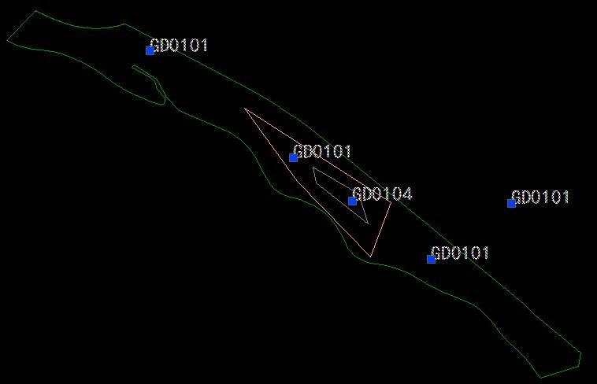
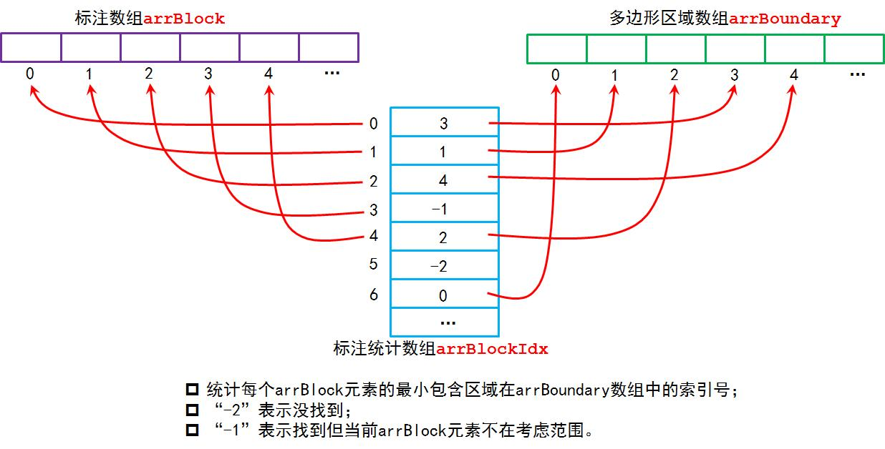
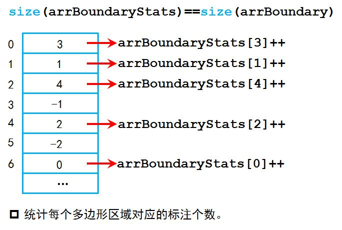
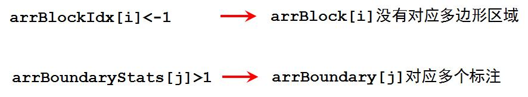

# 区域与对应编号匹配检测


> 对存在嵌套的区域进行编号检测，每个区域只能对应一个编号，且一个编号只能属于一个区域。


# 问题描述
图中有3个多边形区域，依次嵌套，另外还有5个文字注记，它们在图中的位置和形状可以用蓝色点表示。一个多边形区域有且只能对应（包含）一个文字注记，对于嵌套情形，注记属于最小包含该注记的多边形区域。
在这种情况下检查：

1. 所有多边形区域是否包含多个注记？
2. 哪些注记不属于任何一个多边形区域？



# 预定义
* arrBoundary：图中多边形区域存放在该数组；
* arrBlock：标注存放在该数组；

# 处理该问题算法有两个

## 算法一

````
arrFindBoundary; // 预定义一个空数组，用于存放找到的最小包含多边形区域
for i = 1:size(arrBlock)
{
	block = arrBlock[i];
	最小包含block的多边形区域boundary = GetMinimumBoundary(block);

	if boundary为NULL
	{
		output(block不属于任何区域);
		continue;
	}
	
	if boundary in arrFindBoundary
	{
		output(boundary包含多个标注);
	}
	else
	{
		arrFindBoundary.add(boundary);
	}
}

function GetMinimumBoundary(block)
{
	arrCandidates; // 记录备选的区域
	
	for i = 1:size(arrBoundary)
	{
		boundary = arrBoundary[i];
		arrRelatedBd =: 找与boundary相交以及包含的区域（不包括boundary）;
		
		bEmbeded = 0;
		for j = 1:size(arrRelatedBd)
		{
			if arrRelatedBd[j]包含block
			{
				bEmbeded = 1;
				break;
			}
		}

		if !(bEmbeded)
		{
			arrCandidates.add(boundary);
		}
		bdMinArea =: 找arrRelatedBd中面积最小的区域;
	
	}// for: i

	if sizeof(arrCandidates)==1
	{
		return arrCandidates[0];
	}
	else if sizeof(arrCandidates)>1
	{
		return arrCandidates找其中面积中最小的一个;
	}
	else
		return NULL;
}// function
````

## 算法二






# 优化
判断一个区域是否包含一个标注是十分花费时间的，因此在遍历整个多边形区域数组（arrBoundary）时，首先利用当前标注点的外接矩形（可以人为指定一个缓冲矩形）与每个arrBoundary中的元素的外接矩形判断是否相交，将相交的记录在一个数组中，这样再这个缩小范围的数组中遍历，判断是否包含当前标注点。这样就大大较少了判断包含关系的调用，从而较大程度上较少时间复花费（可能减少一个数量级）。

