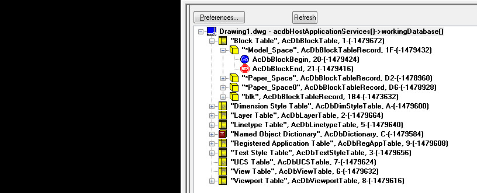

# 看图理解ObjectArx中的数据结构


# 必备工具

* [AsdkInspector插件](./9/AsdkInspector.arx)
* [ObjectARx for AutoCAD 2010: Reference Guide](./9/arxref.chm)


# 总体浏览


图1中红色方框对应的面板就是[AsdkInspector插件](./9/AsdkInspector.arx)，下载之后拖入AutoCAD即可（这里采用的是AutoCAD2008版本）。从图中可以看到Drawing1.dwg对应整个树状结构的根节点，其数据结构是AcDbDatabase，可以通过全局函数acdbHostApplicationServieces()->workingDatabase()获得。它的子节点分别是：

* Block Table，对应数据类型：AcDbBlockTable
* Dimension Style Table， 对应数据类型：AcDbDimStyleTable
* Layer Table，对应数据类型：AcDbLayerTable
* LineType Table，对应数据类型：AcDbLinetypeTable
* Named Object Dictionary，对应数据类型：AcDbDictionary
* Registered Application Table，对应数据类型：AcDbRegAppTable
* Text Style Table，对应数据类型：AcDbTextStyleTable
* UCS Table, 对应数据类型：AcDbUCSTable
* View Table, 对应数据类型：AcDbViewTable
* Viewport Table, 对应数据类型：AcDbViewportTable

它们数据类型的继承结构如图2：

  

可以清晰的看出它们的基类都是`AcDbSymbolTable`。可以将它们都认为是一个Table，既然是Table就应该有响应的Table Record，而通过它们的`getAt()`方法就可获取各自的Table Record。它们的名字与Table相似，例如: `AcDbBlockTable`对应的是`AcDbBlockTableRecord`。这些Table Record的类继承结构与图2中Table一样，具体可以查看Reference Guide。


展开Block Table节点，其包含：

* `*Model_Space`
* `*Paper_Space`
* `*Paper_Space0`

这三个节点，它们的数据类型是: AcDbBlockTableRecord。


# 加入实体的情况

 

在CAD中增加一个矩形实体，在`*Model_Space`中增加了一个AcDbPolyline实体记录。

### (Append)向Block Record中添加Entity的代码：

````
AcDbDatabase* pDb = acdbHostApplicationServices()->workingDatabase();
if (pDb == NULL) 
{
	ads_alert(_T("数据库为空！"));
	return Adesk::kFalse;
}

AcDbBlockTable *pBlockTable;
if (pDb->getBlockTable(pBlockTable, AcDb::kForRead) != Acad::eOk) 
{
	ads_alert(_T("打开块表失败！"));
	return Adesk::kFalse;
}

AcDbBlockTableRecord *pBlockRec;
if (pBlockTable->getAt(ACDB_MODEL_SPACE, pBlockRec, AcDb::kForWrite)
	!= Acad::eOk)
{
	ads_alert(_T("打开块表记录失败！"));
	pBlockTable->close();
	return Adesk::kFalse;
}	

ErrorStatus mtStatus = pBlockRec->appendAcDbEntity(objId, pEntity);
if (mtStatus != Acad::eOk) 
{
	if (mtStatus == Acad::eAlreadyInDb)
	{
		objId = pEntity->objectId();
		if (pEntity->isErased()) pEntity->erase(false);
	}
	else
	{
		ads_alert(_T("增加实体失败！"));
		pBlockTable->close();
		pBlockRec->close();
		return Adesk::kFalse;
	}		
}
pBlockRec->close();
pBlockTable->close();
````


# 添加块的情况

添加块的情况要比添加实体的情况要稍许复杂，在看图分析之前，首先明确两个概念：

* 块定义（Block Define）
* 块参照（Block Reference）

这两个概念可以对比着面向对象中的`Class`和`Object`来理解。Block Define可以理解为Class，在CAD中用`Block`命令在创建，它在CAD界面中是看不见的，但是通过`Insert`命令可以找到，它是对“一类实体的定义”，但它不是实体。Block Reference是对Block Define的“具现化”，即插入至了CAD的界面中。Block Reference是看得见的，因为它的父类是AcDbEntity。

这两个概念最大的好处就是：通过修改Block Define，可以**批量**修改插入进来的Block Reference。


定义一个块后，在`Block Table`下面增加了一个叫做“blk”的AcDbBlockTableRecord，它实际对应前面的“Block Define”，然后再看在`*Model_Space`的Block Table Record中增加了一个叫做“blk”的AcDbBlockReference，它是对前者Block Define的引用。

既然Block Reference是对Block Define的引用，而且Block Reference是看得见的Entity，我们可以选择将其删除，此时Block Reference没有了，但是Block Define还在，如图5。此时只剩下叫做“blk”的Block Define。另外还有一个需要注意的是：我们可以对Block Reference进行“打散”操作（专有名词叫：Explode），此时，Block Reference就成为真正意义上的Entity了，并且它与原来的Block Define就没有关系了。



### 获取块表记录，向其中添加块参照

````
AcDbBlockReference * pBref = new AcDbBlockReference(ptInsert,RcdId);
pBref->setScaleFactors(AcGeScale3d(1,1,1));
pBref->setRotation(dAngle);

AcDbBlockTable *       pBlockTable = NULL;
AcDbBlockTableRecord * pBlockTableRecord = NULL;
acdbHostApplicationServices()->workingDatabase()->getSymbolTable(pBlockTable,AcDb::kForRead);
pBlockTable->getAt(ACDB_MODEL_SPACE,pBlockTableRecord,AcDb::kForWrite);

pBlockTableRecord->appendAcDbEntity(BlockRefId,pBref);

pBlockTableRecord->close();
pBlockTable->close();
````

### 从AcDbTableRecord中采用迭代器读取所有记录

````
pBlkTbl->getAt(ACDB_MODEL_SPACE, pBlkTblRcd, AcDb::kForRead);
pBlkTbl->close();

AcDbBlockTableRecordIterator * pItr = NULL;
pBlkTblRcd->newIterator(pItr);
AcDbObjectId ObjectId;
AcDbEntity * pEnt = NULL;
int i=0;
for (pItr->start(); !pItr->done(); pItr->step())
{
	pItr->getEntity(pEnt, AcDb::kForRead);
	if (pEnt->isKindOf(AcDbBlockReference::desc()) != Adesk::kTrue)
	{
		continue;
	}	
	pItr->getEntityId(ObjectId);
	pEnt->close();
	
	blockIdArray.append(ObjectId);
	i++;
}
````

关于从AcDbDatabase中获取AcDbBlockTable还要再啰嗦一下。

* AcDbDatabase::getSymbolTable()
* AcDbDatabase::getBlockTable()

二者都可以获得AcDbBlockTable，就这点而言，二者没有区别，但是Reference Guide建议使用getSymbolTable()。其中有这么一句话：


如何获取Block Define所有的的块实体（即AcDbBlockReference）？


# 附

### AutoCAD快捷键

| 命令    | 含义    |
| :------ | :------ |
| ArxLoad | 加载arx动态库 |
| P       | 平移    |
| Zoom e  | 缩放    |
| Hatch   | 填充    |
| Insert  | 插入快  |
| Pl      | 插入多断线 |
| HATCHEDIT |  绘制填充区域的边界 |
| Xdlist    |  显示扩展属性(需要安装Express Tools)  |
| Pu(Purge) |  清理各种东西，包括：块参照 |
| Regen     |  重新绘图 |
| blockicon |  重建图标 |


